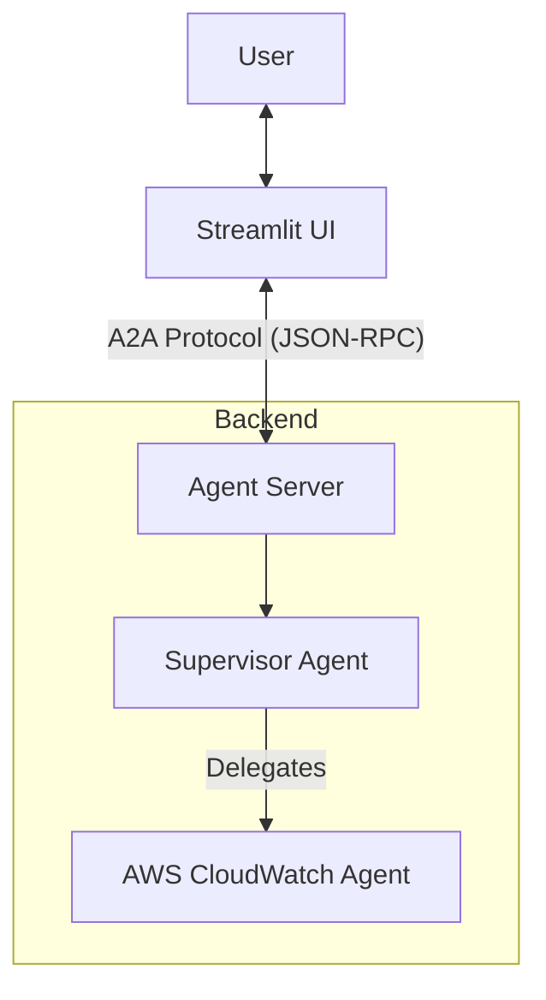

# DevOps Supervisor Agent 🚀

A powerful, multi-agent system designed to assist with infrastructure monitoring and management using the **Strands** framework and **Agent-to-Agent (A2A)** protocol.


## 🌟 Features

- **Multi-Agent Architecture**: A Supervisor agent coordinates specialized sub-agents (e.g., AWS CloudWatch).
- **Native A2A Protocol**: Uses the standard `strands.multiagent.a2a` server and `a2a-sdk` client.
- **Session Management**: Isolated sessions for each user with persistent history.
- **Modern UI**: Built with Streamlit, featuring a custom DevOps theme.
- **Efficiency**: Optimized with caching and pre-compiled regex for high performance.
- **Production Ready**: Dockerized and managed with `uv`.

## 🏗️ Architecture

The system follows a Supervisor-Worker pattern:



See [architecture.md](architecture.md) for detailed design documentation.

## 🚀 Getting Started

### Prerequisites

- Python 3.12+
- `uv` (recommended) or `pip`
- AWS Credentials configured (for CloudWatch agent)

### Local Installation

1.  **Clone the repository:**
    ```bash
    git clone https://github.com/thedevopsstore/DevopsAgent.git
    cd DevopsAgent
    ```

2.  **Install dependencies:**
    ```bash
    uv pip install -r pyproject.toml
    ```

3.  **Start the Backend Server:**
    ```bash
    python main.py
    ```
    The A2A server will start at `http://localhost:9000`.

4.  **Start the UI:**
    ```bash
    streamlit run ui/app.py
    ```
    Access the UI at `http://localhost:8501`.

### 🐳 Docker Deployment

1.  **Build the image:**
    ```bash
    docker build -t devops-agent .
    ```

2.  **Run the container:**
    ```bash
    docker run -p 8501:8501 -p 9000:9000 --env-file .env.local devops-agent
    ```

## 🛠️ Configuration

Create a `.env` file with the following variables:

```env
# A2A Server
A2A_HOST=0.0.0.0
A2A_PORT=9000
A2A_VERSION=0.3.0

# AWS
AWS_REGION=us-east-1
```

## 🤝 Contributing

Contributions are welcome! Please feel free to submit a Pull Request.
