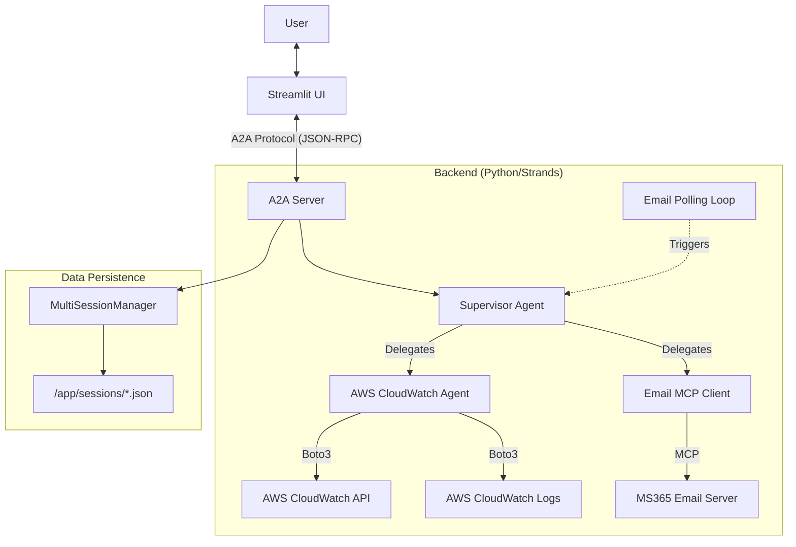

# DevOps Agent Architecture & Design Document

## 1. System Overview
The **DevOps Supervisor Agent** is an intelligent, multi-agent system designed to assist with infrastructure monitoring and management. It uses a **Supervisor-Worker** pattern where a central Supervisor agent coordinates specialized sub-agents (AWS CloudWatch, Email) to fulfill user requests.

The system is built on the **Strands** framework and uses the **Agent-to-Agent (A2A)** protocol for standardized communication between the frontend UI and the backend agent server. It supports both interactive chat sessions and autonomous background operations (email polling).

## 2. High-Level Architecture



## 3. Core Components

### 3.1. Frontend (Streamlit UI)
- **Path**: `ui/app.py`
- **Role**: User interface for chatting with the agent.
- **Key Features**:
    - **A2A Client**: Uses `a2a-sdk` to communicate with the backend.
    - **Caching**: Caches the Agent Card using `@st.cache_resource` to minimize network overhead.
    - **Session Management**: Generates a unique UUID `user_session_id` for each browser tab/user.
    - **Theming**: Custom DevOps-themed UI (Blue Gear icon).

### 3.2. Backend Server
- **Path**: `core/server.py`
- **Role**: Hosts the agents and exposes them via the A2A protocol.
- **Key Features**:
    - **A2AServer**: Uses `strands.multiagent.a2a.A2AServer` to provide JSON-RPC endpoints.
    - **SessionAwareAgent**: A wrapper that routes incoming requests to the correct agent instance based on `session_id`.
    - **MultiSessionManager**: Manages the lifecycle of agent instances per session.
    - **SummarizingConversationManager**: Automatically summarizes conversation history to manage context window efficiency (keep last 10 messages, summarize 40%).

### 3.3. Agents
- **Supervisor Agent** (`agents/supervisor.py`):
    - **Model**: Claude 3.5 Haiku (via Bedrock).
    - **Role**: Router/Orchestrator. Analyzes user intent and calls the appropriate tool.
    - **Tools**: 
        - `aws_cloudwatch_tool`: Delegates to AWS Agent.
        - `list-mail-messages`, `send-mail`, etc.: Direct MCP tools for email.
- **AWS CloudWatch Agent** (`agents/aws.py`):
    - **Model**: Claude 3.5 Haiku.
    - **Role**: Specialist. Executes specific AWS commands.
    - **Tools**: `list_metrics`, `get_metric_statistics`, `describe_alarms`, `filter_log_events`.

### 3.4. Autonomous Services
- **Email Polling** (`core/email_polling.py`):
    - **Role**: Periodically checks for new emails to trigger autonomous actions.
    - **Mechanism**: Runs an async loop that creates a **fresh, ephemeral session** for each poll.
    - **Context**: Uses `AUTONOMOUS_SESSION_ID-<timestamp>` to ensure no context is carried over between polls (stateless execution).
    - **Cleanup**: Automatically deletes session files after each poll to prevent disk clutter.

### 3.5. Configuration
- **Path**: `core/config.py`
- **Library**: `pydantic-settings`.
- **Source**: Environment variables (`.env` or system env).
- **Key Settings**: `A2A_HOST`, `A2A_PORT`, `AWS_REGION`, `EMAIL_MCP_SERVER_URL`, `EMAIL_POLL_INTERVAL`.

## 4. Data Flow

### 4.1. User Interaction
1.  **User Input**: User types a message in Streamlit.
2.  **UI Processing**:
    - UI appends `session_id` to the message text.
    - UI sends message to `http://localhost:9000/` via A2A client.
3.  **Server Routing**:
    - `A2AServer` receives the request.
    - `SessionAwareAgent` extracts `session_id` from the message (via regex).
    - `MultiSessionManager` retrieves or creates the agent for that session.
4.  **Agent Execution**:
    - **Supervisor** receives the message.
    - Supervisor plans and executes tools (AWS, Email).
    - Results are returned up the chain.
5.  **Response**:
    - Agent generates a text response.
    - Server wraps it in an A2A `Task` object.
    - UI receives the `Task`, extracts the text from `artifacts`, and displays it.

### 4.2. Autonomous Email Polling
1.  **Trigger**: `email_polling_loop` wakes up (default: 60s).
2.  **Session Creation**: Creates a unique session ID `autonomous-<timestamp>`.
3.  **Prompt**: Sends a system prompt: "Check for new emails...".
4.  **Execution**: Supervisor uses `list-mail-messages` tool.
5.  **Action**: If emails found, Supervisor reads content and takes action (e.g., check AWS metrics, reply).
6.  **Cleanup**: Session file is deleted.

## 5. Deployment & Logging

### 5.1. Docker
- **Base Image**: Python 3.12-slim.
- **Startup**: `start_services.sh` handles the sequence:
    1.  Start Backend (`main.py`) in background.
    2.  Wait for port 9000.
    3.  Start Frontend (`streamlit run ui/app.py`).
- **Logging**:
    - Backend logs are piped to **both** stdout (for `docker logs`) and `/app/logs/backend.log` (for persistence).
    - `strands` library logging is set to `DEBUG` to show agent thought process.

### 5.2. Kubernetes (Planned)
- Designed to run as a single Pod containing both containers (or single container with supervisor process).
- **Identity**: Uses AWS Pod Identity for `boto3` credentials (no hardcoded keys).

## 6. Directory Structure

```text
devops_agent/
├── agents/                 # Agent definitions
│   ├── aws.py              # AWS Specialist
│   ├── aws_mcp_agent.py    # (Legacy/Alternative)
│   └── supervisor.py       # Supervisor Agent
├── core/                   # Core infrastructure
│   ├── config.py           # Settings (Pydantic)
│   ├── email_polling.py    # Autonomous polling logic
│   └── server.py           # A2A Server & Session logic
├── ui/                     # Frontend
│   ├── app.py              # Streamlit App
│   └── gear_icon.svg       # UI Asset
├── sessions/               # Persisted session data (JSON)
├── main.py                 # Entry point
├── start_services.sh       # Docker startup script
├── pyproject.toml          # Dependencies (UV)
└── Dockerfile              # Container config
```
